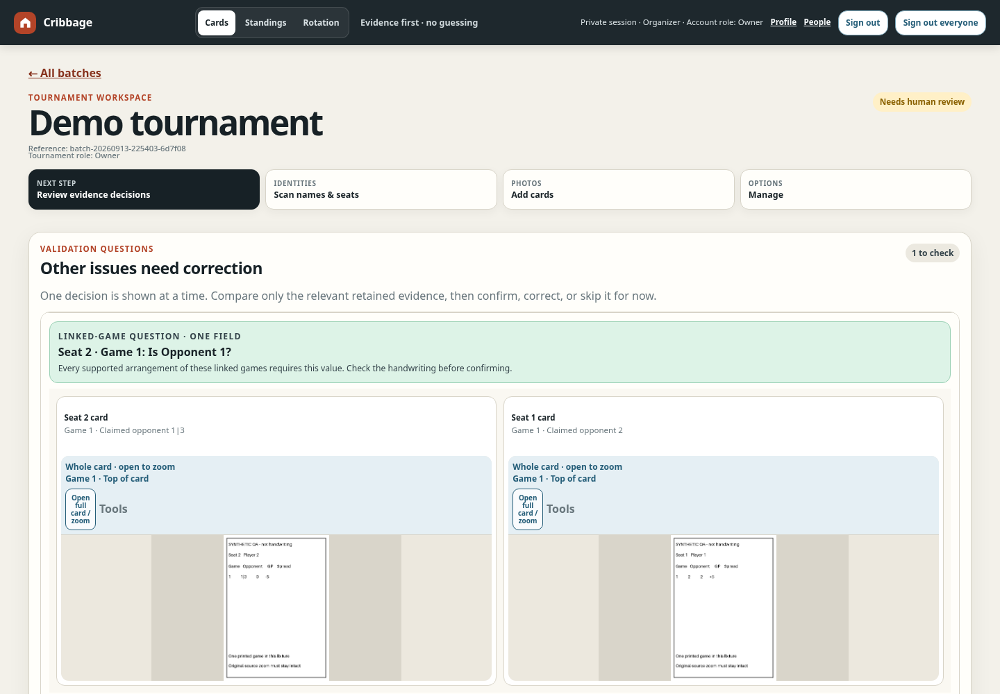
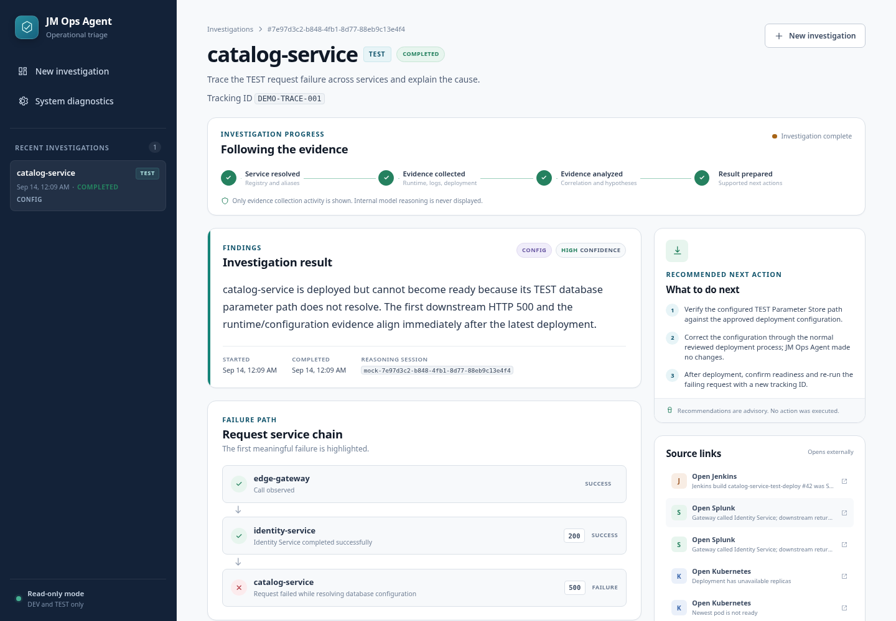

# Jeremy Mackey

Software Engineer

## Recent projects

Screenshots use demo data. Select an image for more views and capture details.

### [Cribbage Tournament Review](projects/cribbage.md)

A phone-first app for turning handwritten score-card photos into reviewed tournament results. Combines AI-assisted reading, cross-card validation, and focused correction tools. Source private.

### [Multiplayer Poker](projects/poker.md)

A real-time poker app built with Elixir/Phoenix, PostgreSQL, and Expo/React Native. Browser staging uses synthetic data; mobile clients share the same backend. Source private.

### [PaneFleet](https://github.com/jmac4909/PaneFleet)

A Node.js dashboard for supervising terminal-based coding agents from desktop or phone. It adds project context, durable work queues, and exact-pane input delivery to tmux. Uncertain actions stay visible for review rather than being retried blindly.

[Architecture](https://github.com/jmac4909/PaneFleet/blob/main/docs/architecture.md) · [Safety model](https://github.com/jmac4909/PaneFleet/blob/main/docs/safety-model.md) · [Run locally](https://github.com/jmac4909/PaneFleet#quick-start)

### [Kronos](https://github.com/jmac4909/Kronos)

A TypeScript VS Code extension that brings Jira, GitLab, Jenkins, and SonarQube context into a terminal-first workflow. Provider access is read-only; the developer controls execution and submission. No third-party runtime dependencies.

[Product contract](https://github.com/jmac4909/Kronos/blob/main/docs/terminal-first-product-contract.md) · [State ownership](https://github.com/jmac4909/Kronos/blob/main/docs/state-ownership.md) · [Try the preview](https://github.com/jmac4909/Kronos#try-it-locally)

### [JM Ops Agent](https://github.com/jmac4909/jm-ops-agent)

A Java 21 / Spring Boot proof of concept for read-only service investigations. It correlates evidence across services and presents a diagnosis without applying changes. The local mock demo runs without enterprise credentials, external services, or model usage.

[Architecture](https://github.com/jmac4909/jm-ops-agent/blob/main/docs/architecture.md) · [Investigation design](https://github.com/jmac4909/jm-ops-agent/blob/main/docs/adaptive-investigations.md) · [Run the mock demo](https://github.com/jmac4909/jm-ops-agent#run-the-zero-connectivity-demo)

The developer-tool repositories include source, design notes, and reproducible checks. Kronos is preview software; JM Ops Agent is a proof of concept.
