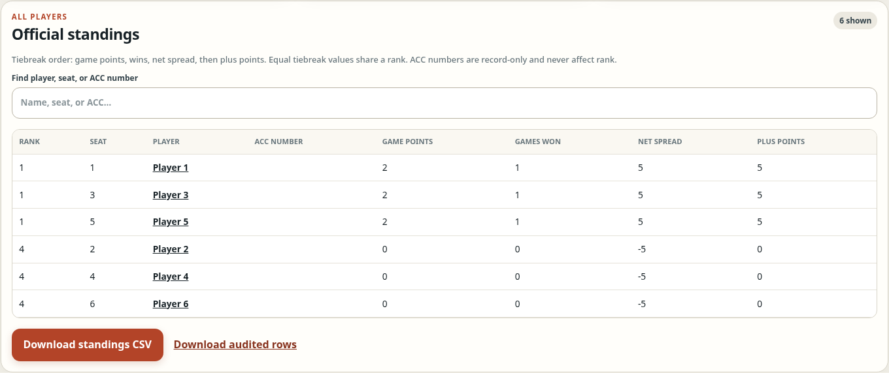

# Jeremy Mackey

Software Engineer

## Selected projects

[JM Ops Agent · Java](https://github.com/jmac4909/jm-ops-agent) · [PaneFleet · Node.js](https://github.com/jmac4909/PaneFleet) · [Kronos · TypeScript](https://github.com/jmac4909/Kronos)

Source, architecture notes, and local setup are linked below. Screenshots show real application interfaces with demo data; select an image for more views.

### [JM Ops Agent](https://github.com/jmac4909/jm-ops-agent)

A Java 21 / Spring Boot proof of concept for read-only service investigations. It traces failures across services and presents a diagnosis with supporting evidence. The local mock demo runs without enterprise credentials, external services, or model usage.

[Architecture](https://github.com/jmac4909/jm-ops-agent/blob/main/docs/architecture.md) · [Investigation design](https://github.com/jmac4909/jm-ops-agent/blob/main/docs/adaptive-investigations.md) · [Run the mock demo](https://github.com/jmac4909/jm-ops-agent#run-the-zero-connectivity-demo)

### [PaneFleet](https://github.com/jmac4909/PaneFleet)

A Node.js dashboard for supervising terminal-based coding agents from desktop or phone. It adds project context, durable work queues, and exact-pane input delivery to tmux. Uncertain actions stay visible for review rather than being retried blindly.

[Architecture](https://github.com/jmac4909/PaneFleet/blob/main/docs/architecture.md) · [Safety model](https://github.com/jmac4909/PaneFleet/blob/main/docs/safety-model.md) · [Run locally](https://github.com/jmac4909/PaneFleet#quick-start)

### [Kronos](https://github.com/jmac4909/Kronos)

A TypeScript VS Code extension that brings Jira, GitLab, Jenkins, and SonarQube context into a terminal-first workflow. Provider access is read-only; the developer controls execution and submission. No third-party runtime dependencies.

[Product contract](https://github.com/jmac4909/Kronos/blob/main/docs/terminal-first-product-contract.md) · [State ownership](https://github.com/jmac4909/Kronos/blob/main/docs/state-ownership.md) · [Try the preview](https://github.com/jmac4909/Kronos#try-it-locally)

Kronos is preview software; JM Ops Agent is a proof of concept.

## Application showcases

These projects have private source code. The linked write-ups explain their workflows and engineering.

### [Cribbage Tournament Review](projects/cribbage.md)

A phone-first Python/web app for turning handwritten score-card photos into reviewed tournament results. Combines AI-assisted reading, cross-card validation, and focused correction tools.

### [Multiplayer Poker](projects/poker.md)

A real-time poker app built with Elixir/Phoenix, PostgreSQL, and Expo/React Native. The server owns game state and tournament progression; web and mobile clients share the same backend.

