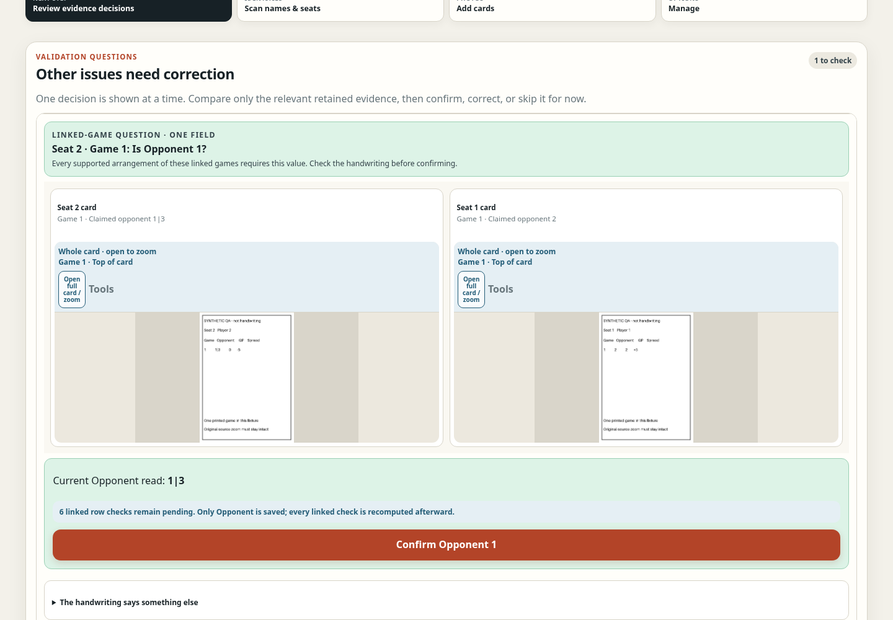

# Cribbage Tournament Review

A phone-first web app for reviewing handwritten tournament score cards.

Actual application UI, captured locally with synthetic score cards—not private tournament photos or an OCR accuracy demonstration.

## The problem

Reading every card, correcting transcription errors, and reconciling results is repetitive work. The goal is to let an organizer resolve the entries that genuinely need attention without retyping the whole tournament.

## How it works

1. Upload photographs of the score cards.
2. AI-assisted reading produces draft identities and game rows.
3. Deterministic checks compare reciprocal games across opponents' cards, scoring, and totals.
4. The reviewer resolves uncertain or conflicting entries against the retained photos before results become official.

The correction interface brings the relevant cards together, keeps the original image accessible, and supports paired corrections when the match is unambiguous. An uncertain reading is not silently treated as a verified result.

One focused question, both source cards, and an explicit confirmation. Dependent checks are recomputed after the decision.

## Engineering

Python backend, browser-based mobile UI, background reading jobs, role-scoped tournament access, and evidence-backed validation. Original uploads and review decisions are retained so results can be traced back to their source.

The central tradeoff is reducing manual work without hiding errors. The system separates a suggested reading from an accepted result; fewer clicks alone do not establish better accuracy or less total work.

Source code is private.
