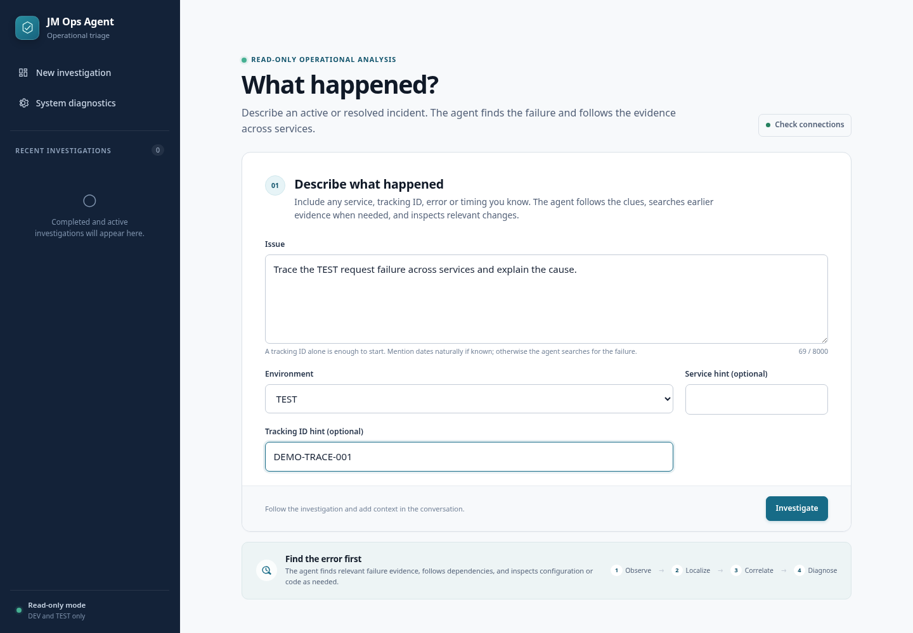

# JM Ops Agent

A Java 21 / Spring Boot proof of concept for read-only service investigations.

## Investigation result

The built-in demo follows a request through Edge Gateway and Identity Service to a failing Catalog Service. It correlates the failure with a configuration change and presents recommended next steps without applying them.

## Starting an investigation

Describe the incident and supply any known service, environment, or tracking clues. The result preserves supporting evidence for review and follow-up questions.

These screenshots come from a completed run of the actual application in its `local-mock` profile, using fictional fixtures and a disposable in-memory database. No enterprise systems, credentials, or model calls were used. The displayed confidence belongs to the deterministic demo, not an independent accuracy benchmark.

[Source](https://github.com/jmac4909/jm-ops-agent) · [Architecture](https://github.com/jmac4909/jm-ops-agent/blob/main/docs/architecture.md) · [Run the demo](https://github.com/jmac4909/jm-ops-agent#run-the-zero-connectivity-demo)
