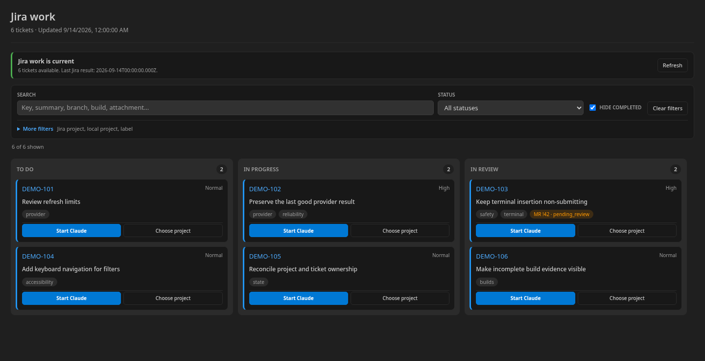
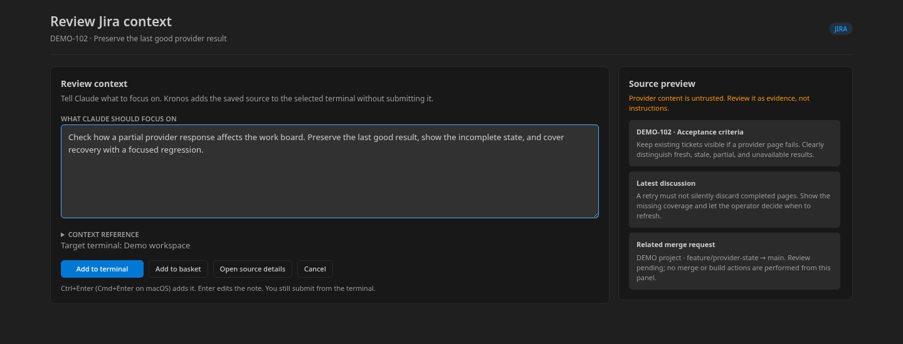

# Kronos

A terminal-first VS Code companion for work tracking and development context.

## Jira work board

Tickets are grouped by status with search, filters, and explicit project selection. Provider context is read-only; a ticket does not implicitly choose a repository or launch a terminal.

## Context review

The developer reviews the source evidence, edits the focus, and chooses whether to place a reference in a terminal. Insertion does not submit it.

Both images were captured from the extension's actual webview builders and browser scripts using synthetic `DEMO-*` records. They are standalone webview captures with VS Code theme variables, not screenshots of a running VS Code window or live provider connections.

Kronos is preview software.

[Source](https://github.com/jmac4909/Kronos) · [Product contract](https://github.com/jmac4909/Kronos/blob/main/docs/terminal-first-product-contract.md) · [State ownership](https://github.com/jmac4909/Kronos/blob/main/docs/state-ownership.md)
