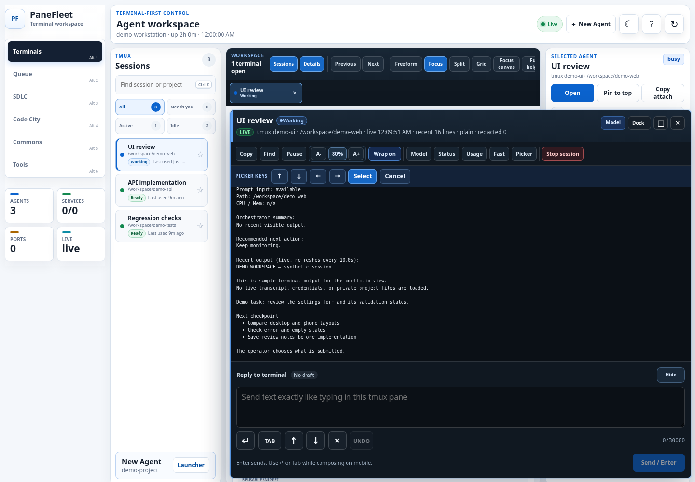
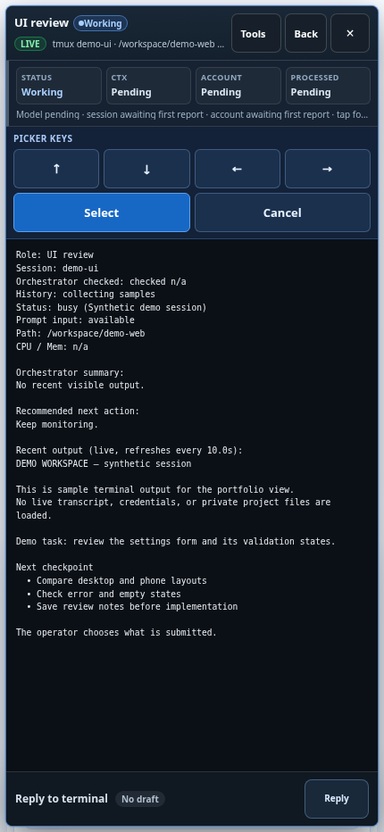

# PaneFleet

A desktop and phone workspace for supervising terminal-based coding agents.

## Terminal workspace

The session list, selected-agent details, terminal view, and reply controls stay together. Input is bound to an exact pane; opening or closing a view does not start or stop its worker.

## Phone view

The responsive interface keeps terminal output and reply controls accessible on a smaller screen.

These are captures of the actual frontend with synthetic API fixtures, session identities, and sample terminal text. No live host data or private transcripts were loaded; no worker input was sent. The phone view was captured at phone width in a browser, not on a physical device.

[Source](https://github.com/jmac4909/PaneFleet) · [Architecture](https://github.com/jmac4909/PaneFleet/blob/main/docs/architecture.md) · [Safety model](https://github.com/jmac4909/PaneFleet/blob/main/docs/safety-model.md)
