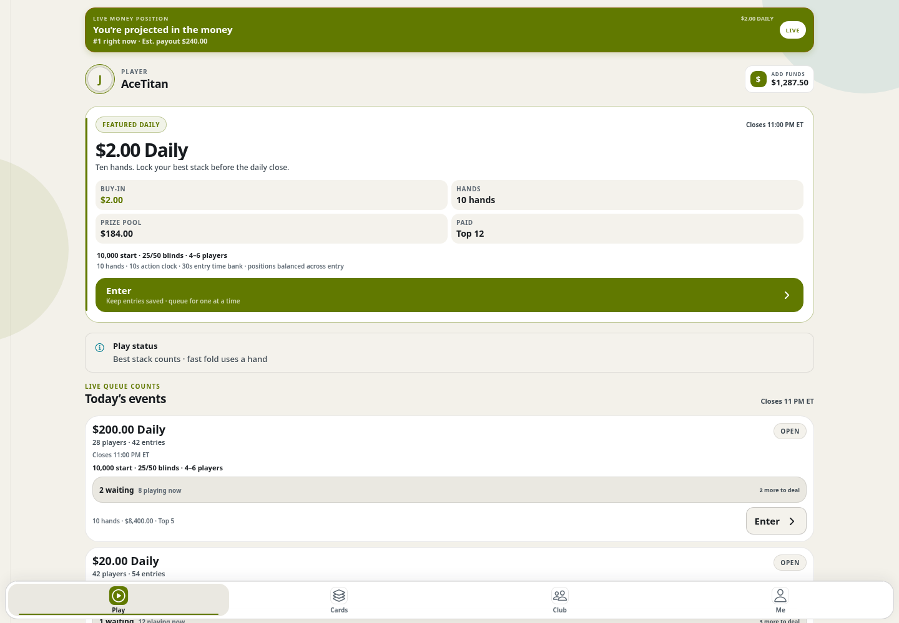
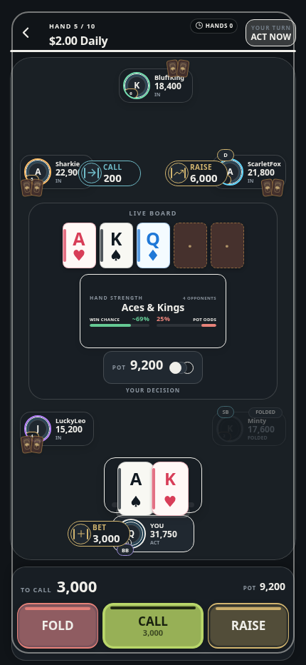

# Multiplayer Poker

A real-time poker application with a shared backend for web and mobile clients.

Actual application UI, captured locally with synthetic players, balances, and game state.

## The application

The app connects players through matchmaking and live tables, with tournament progression and account state managed by the server. The browser client is an Expo web build; the backend uses Elixir/Phoenix and PostgreSQL.

The same table screen at phone width in the browser; this is not a native-device capture.

## Engineering

- **Server-owned game state.** The backend validates actions and owns the table state; clients present the current state and submit player decisions.
- **Real-time communication.** Phoenix channels connect the client to live table and matchmaking updates.
- **Shared client foundation.** Expo/React Native supports web and mobile development against the same service and protocol.
- **Reconnect and session handling.** Queue membership, authentication, and disconnection behavior are explicit parts of the application contract.
- **State reconciliation.** Tournament results and account-ledger changes can be checked together rather than trusting aggregate totals alone.

## Status

The browser app runs in staging with synthetic data and automated players for development testing. Native clients are in development.

Source code is private.
